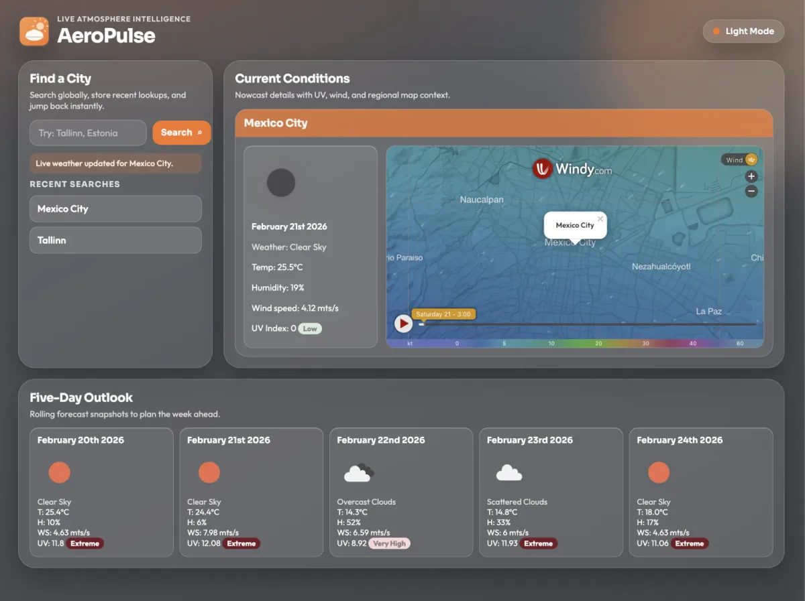

# 🌤️ AeroPulse Weather Dashboard

### A weather command center for checking current conditions, a 5-day outlook, and a live Windy map in one place.

AeroPulse is a browser-based weather dashboard with a custom Node server that proxies OpenWeather requests and serves a polished frontend from the same app. It is built to be easy to run locally now and easy to deploy later with environment-based API keys.

---

## ✨ Features

| | Feature | What It Does |
|---|---|---|
| 🔎 | City Search | Search any city and fetch fresh weather data through the backend proxy. |
| 🕘 | Recent Search History | Stores up to 10 recent city lookups in `localStorage` for quick reuse. |
| 🌡️ | Current Conditions | Shows live weather, temperature, humidity, wind speed, and UV index status. |
| 📅 | 5-Day Forecast | Renders a compact 5-day forecast grid with icons and key metrics. |
| 🗺️ | Windy Map Integration | Displays an interactive Windy map centered on the selected city. |
| 🌓 | Theme Toggle | Supports light/dark mode with saved user preference. |

---

<p align="center">
  
</p>

---

## 🛠️ Tech Stack


---

## 🧩 Project Snapshot

- Single Node server (`server.js`) serves the frontend and proxies OpenWeather API requests.
- Frontend lives in `client/` (`index.html`, `style.css`, `app.js`) with CDN-loaded jQuery, Moment.js, Leaflet, and Windy SDK.
- API routes:
  - `GET /api/config` returns the Windy key used by the frontend map integration.
  - `GET /api/weather?q=city` fetches city coordinates/current weather lookup.
  - `GET /api/onecall?lat=...&lon=...` fetches current + daily forecast data.
- Search history and theme preference are stored in browser `localStorage`.
- Deployment-ready basics added: environment file template, `package.json` start script, and static file serving from `client/`.

---

## 🚀 Live Demo


[](https://github.com/jorguzman100/weather-dashboard)

No public deployment yet. Local run is fully supported and ready for a later deploy.

---

## 💻 Run it locally

```bash
git clone https://github.com/jorguzman100/weather-dashboard.git
cd weather-dashboard
npm install
cp .env_example .env
# add your API keys in .env
npm start
```

Local URL:

- App + API: `http://localhost:8000`

<details>
<summary>🔑 Required environment variables</summary>

```env
OPENWEATHER_API_KEY=
WINDY_API_KEY=
PORT=8000
```

Notes:
- Windy uses a browser SDK, so its key is delivered to the client at runtime via `/api/config`.
</details>

---

## 🤝 Contributors

- **Jorge Guzman** · [@jorguzman100](https://github.com/jorguzman100)
